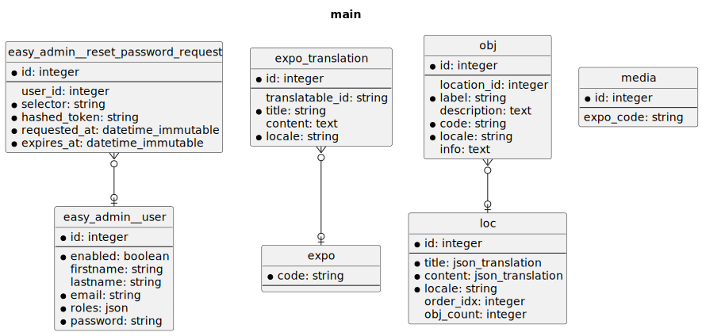

# survos-sites/modo

## Installation

```bash
git clone git@github.com:survos-sites/modo modo && cd modo
echo "DATABASE_URL=sqlite:///%kernel.project_dir%/var/data.db" > .env.local
echo "DATABASE_URL=sqlite:///%kernel.project_dir%/var/data_test.db" > .env.test
composer install
bin/console doctrine:schema:update --force
symfony server:start -d
symfony open:local
```


## Running tests

```bash
bin/console doctrine:schema:update --force --env=test
bin/console doctrine:fixtures:load -n --env=test
vendor/bin/phpunit
```


    usage here.

## Database




```bash
git clone git@github.com:survos-sites/modo.git && cd modo
composer install
./c d:sch:update --force
./c d:f:load -n
symfony server:start -d
symfony open:local
symfony open:local --path=/admin/browse/en

```

## Data


*build with survos/doc-bundle*
